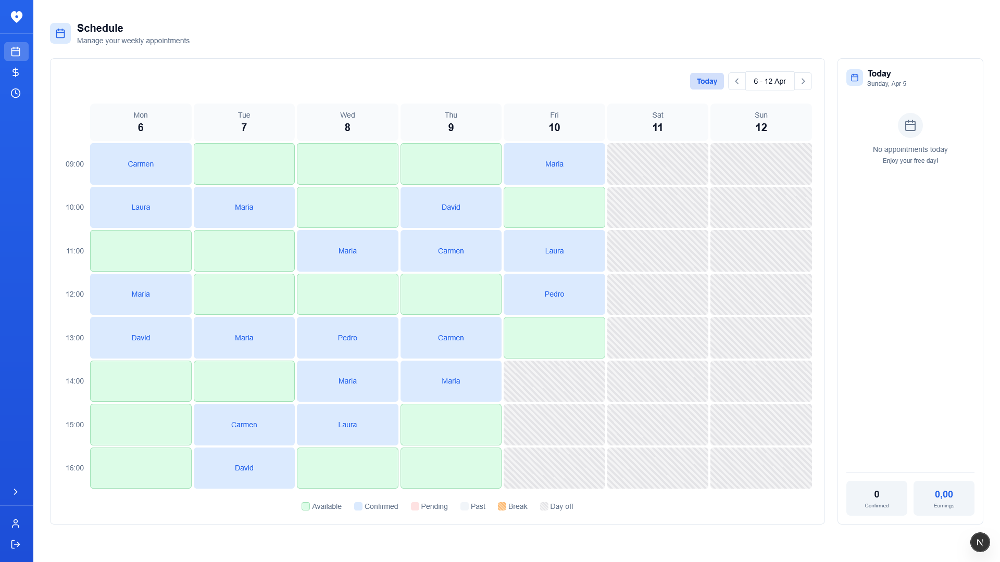
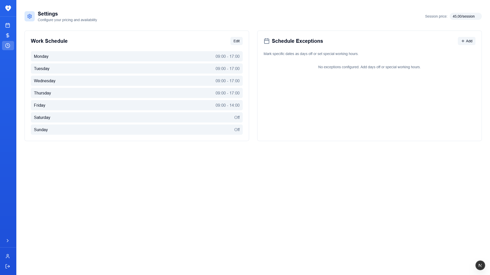
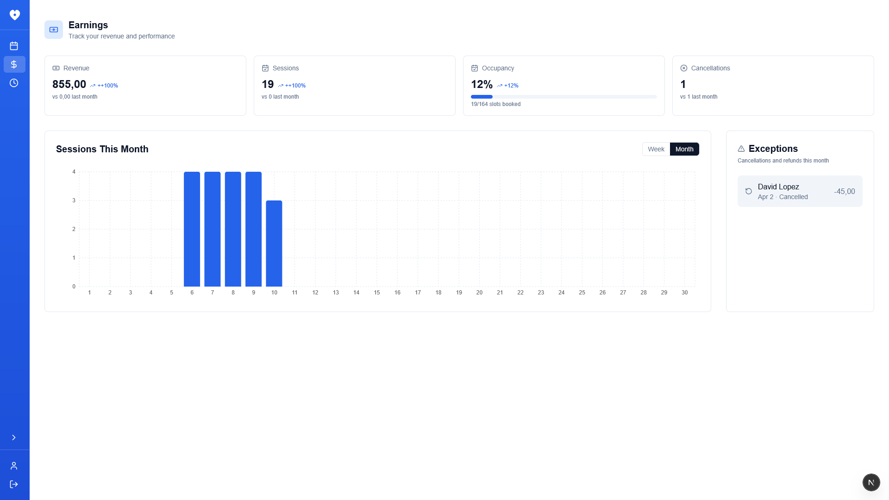
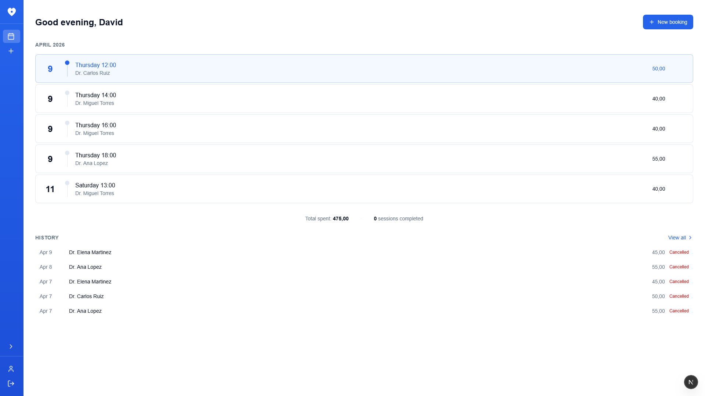
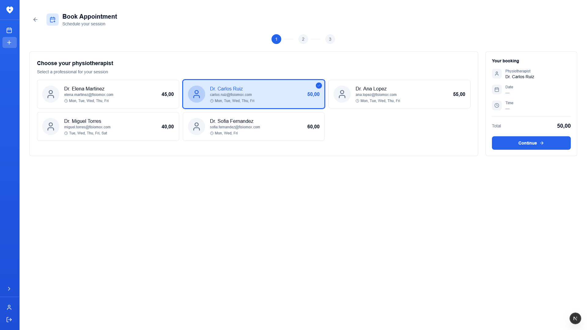
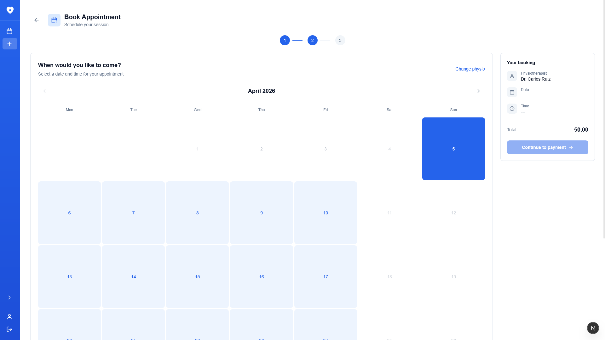
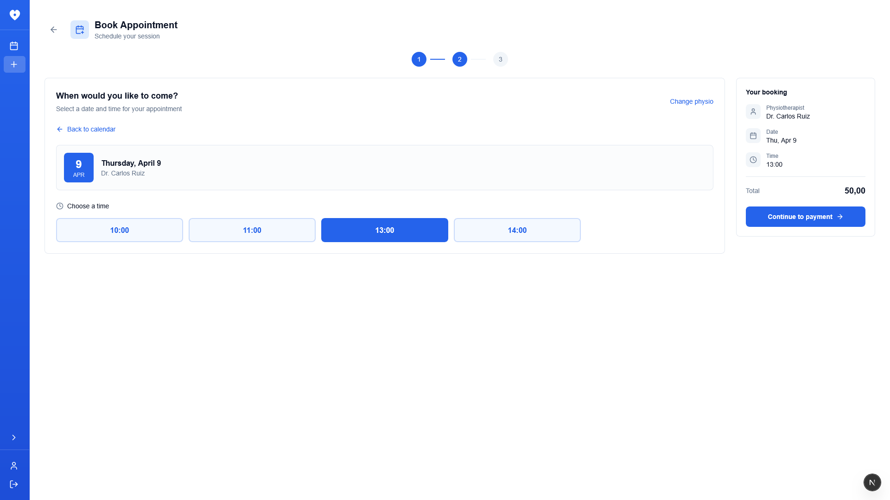
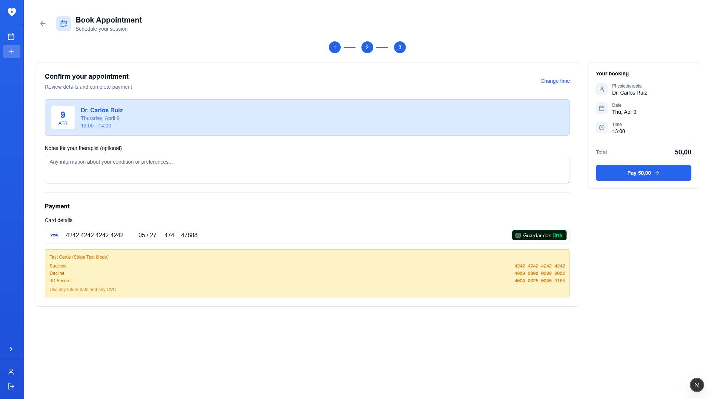

# FisioMox

A full-stack appointment management system designed for physiotherapy clinics. Built with modern technologies and best practices to provide a seamless experience for physiotherapists and patients.


## Features

### For Physiotherapists
- **Weekly Calendar**: Visual schedule management with appointment details
- **Today's Panel**: Quick view of daily appointments
- **Earnings Dashboard**: Revenue statistics, charts, and monthly payment tracking
- **Pricing & Hours**: Configure session price and weekly work schedule
- **Schedule Exceptions**: Set days off or modified hours for specific dates
- **Appointment Management**: View details and cancel appointments

### For Patients
- **Browse Physiotherapists**: View available physios with their schedules and prices
- **Online Booking**: Select date and time slot based on physio availability
- **Stripe Payments**: Secure online payment processing
- **Appointment History**: Track upcoming and past appointments
- **Self-service Cancellation**: Cancel appointments when needed

### Multi-Role System
- **Physiotherapist**: Full dashboard with schedule, earnings, and configuration
- **Patient**: Booking interface and appointment management

> **Note**: For demonstration purposes, anyone can register as a physiotherapist to fully test the application. In a production environment, an admin role would be implemented to manage staff registration.

### Technical Highlights
- Conflict detection prevents double-booking
- Automatic cleanup of expired unpaid reservations
- Session-based authentication with httpOnly cookies
- Role-based access control (RBAC)
- Rate limiting and input validation
- Stripe webhook integration for payment status updates

## Screenshots

<div align="center">

### Physio Schedule


### Physio Settings


### Earnings Dashboard


### Patient Dashboard


### Booking Flow
#### Step 1

#### Step 2

#### Step 2.5

#### Step 3


</div>

## Tech Stack

### Backend
| Technology | Purpose |
|------------|---------|
| Express.js 5 | REST API framework |
| TypeScript | Type safety |
| Prisma | ORM & database management |
| Stripe | Payment processing |
| Vitest | Unit & integration testing |

### Frontend
| Technology | Purpose |
|------------|---------|
| Next.js 16 | React framework with App Router |
| React 19 | UI library |
| TypeScript | Type safety |
| Tailwind CSS v4 | Styling |

### Infrastructure
| Technology | Purpose |
|------------|---------|
| PostgreSQL | Database |

## Project Structure

```
backend/
└── src/
    ├── controllers/    # Business logic
    ├── middleware/     # Auth, validation, rate limiting
    ├── routes/         # API endpoints
    ├── lib/            # Prisma, Stripe clients
    ├── jobs/           # Scheduled tasks (cleanup)
    └── tests/          # Test suites

frontend/
└── src/
    ├── app/            # Next.js App Router pages
    ├── components/     # React components
    ├── hooks/          # Custom React hooks
    └── contexts/       # Auth context
```

## Getting Started

### Prerequisites

- Node.js >= 18.0.0
- PostgreSQL database
- Stripe account (for payments)

### Installation

```bash
# Clone the repositories
git clone https://github.com/yourusername/fisiomox-backend.git
git clone https://github.com/yourusername/fisiomox-frontend.git

# Backend setup
cd fisiomox-backend
npm install
cp .env.example .env
npx prisma generate
npx prisma migrate dev

# Frontend setup
cd ../fisiomox-frontend
npm install
cp .env.example .env.local
```

### Environment Variables

**Backend**
```env
DATABASE_URL=postgresql://...
STRIPE_SECRET_KEY=sk_...
STRIPE_WEBHOOK_SECRET=whsec_...
SESSION_SECRET=your-secret
PORT=3001
```

**Frontend**
```env
NEXT_PUBLIC_API_URL=http://localhost:3001
```

## API Overview

The API follows REST principles with versioned endpoints under `/api/v1/`.

| Method | Endpoint | Description |
|--------|----------|-------------|
| POST | `/api/v1/auth/register` | User registration |
| POST | `/api/v1/auth/login` | User authentication |
| GET | `/api/v1/physios` | List physiotherapists |
| GET | `/api/v1/appointments` | List user appointments |
| POST | `/api/v1/appointments` | Create appointment |
| GET | `/api/v1/work-schedule` | Get work schedule |
| PUT | `/api/v1/work-schedule` | Update work schedule |
| GET | `/api/v1/schedule-exceptions` | Get schedule exceptions |
| POST | `/api/v1/payments` | Create payment intent |

## Scripts

### Backend
```bash
npm run dev           # Development server
npm run build         # Production build
npm run test          # Run tests (watch mode)
npm run test:run      # Run tests once
npm run lint          # Code linting
npm run lint:fix      # Fix linting issues
npm run format        # Format code
npx prisma migrate dev    # Database migrations
npx prisma generate       # Regenerate Prisma client
```

### Frontend
```bash
npm run dev           # Development server
npm run build         # Production build
npm run lint          # Code linting
npm run lint:fix      # Fix linting issues
npm run format        # Format code
```
